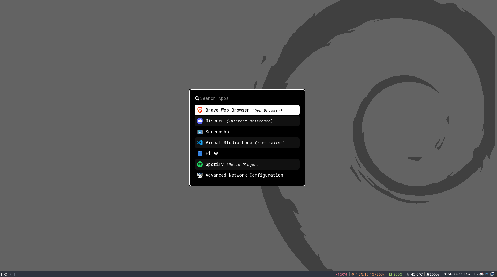
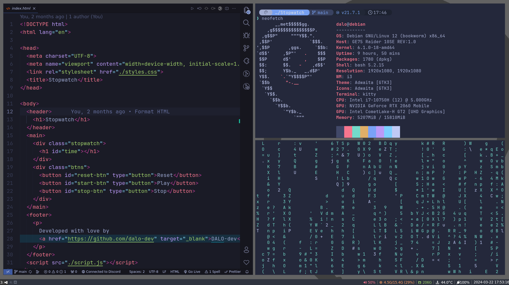

# Dotfiles

This repository contains my personal dotfiles, configurations, and setup scripts for various tools and applications. Dotfiles are configurations files used to personalize and customize the behavior of software tools in Unix-like operating systems.

## Screenshots

## Techs used

- **OS:** [Debian GNU/Linux 12 (bookworm) x86_64](https://www.debian.org/index.html)
- **WM:** [I3WM](https://i3wm.org/)
- **Shell:** Bash 5.2.15 with [Starship](https://starship.rs/)
- **Terminal Emulator:** [Kitty](https://sw.kovidgoyal.net/kitty/)
- **Bar:** [i3blocks](https://github.com/vivien/i3blocks?tab=readme-ov-file)
- **App Launcher:** [rofi](https://github.com/davatorium/rofi)
- **Editor:** [Visual Studio Code](https://code.visualstudio.com/)
- **Font:** [JetBrainsMono Nerd Font](https://www.programmingfonts.org/#jetbrainsmono)
- **Theme:** [Tokyo Night](https://github.com/enkia/tokyo-night-vscode-theme)
